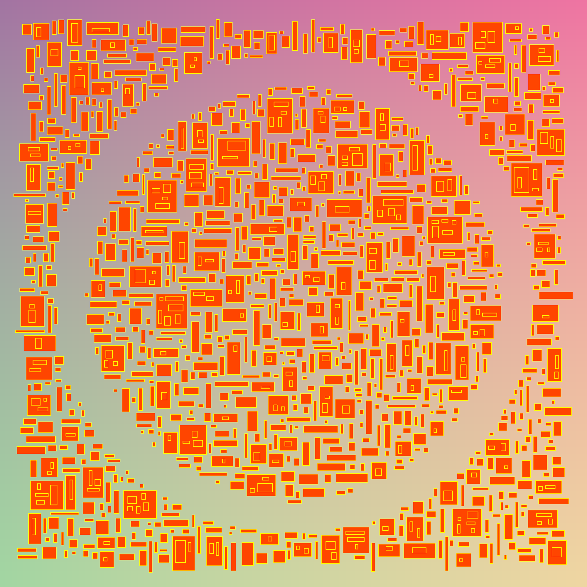

# generative_rectangle_nannou

A generative art project that draws packed rectangles where edges don't overlap.

Written in Rust, using Nannou framework (https://nannou.cc).

## Features

- algorithm that draws packed rectangles
- demonstration of intermediary image buffers
  - useful for creating a background texture and apply that to the frame
  - useful for tracking existing rectangles
    - to efficiently determine open areas to place new rectangles as well as areas that should remain free of rectangles (which is how the circular area was left open in the example image).
- demonstration of a seeded random number generator to allow for reproducible results
- capture frame as a PNG image in the `capture` directory (when app window is closed)

## Example



## How to run

```bash
cargo run --release
```
